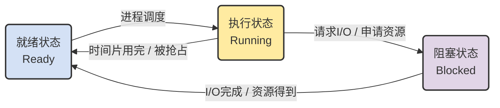

## 第一章 绪论

### 地位


 操作系统的地位：紧贴硬件之上，并在所有其他软件之下。提供其他软件的支撑环境，是计算机资源的管理者。


### 定义

操作系统（Operating System，OS）

 是管理和控制计算机系统中各种硬件和软件资源、合理地组织计算机工作流程的系统软件，是用户与计算机之间的接口。


从下面几个方面来理解操作系统（OS）的定义：

1. 第一，OS 是系统软件，由一整套程序组成
2. 第二，OS 的基本职能
3. 第三，OS 为用户提供友好、可靠、安全的服务

 ### 作用

**(1) OS 作为计算机系统的资源管理者**

- 管理的对象：CPU、存储器、外部 I/O 设备、信息（数据和软件）
- 管理的内容：资源的当前状态（数量和使用情况）、资源的分配 / 回收 / 访问操作、相应管理策略（包括用户权限）

**(2) OS 作为用户与计算机硬件之间的接口**

- 系统命令
  - 形式：命令行、菜单式、命令脚本式、图形用户接口 GUI
- 系统调用
  - 特点：形式类似过程调用，用于应用编程

**(3) OS 作为虚拟机、扩展机**

- 概念：裸机（Bare machine）→ 虚拟机（Virtual machine）、扩展机（Extended machine）
- 核心作用：将裸机改造为功能更强、更易用的机器
  - 新增功能：设备管理、文件管理、存储管理、处理机管理、用户接口
  - 流程组织：作业管理、进程管理

### 发展

**必考填空，给特点填写名称**

#### 1.手工操作阶段：（1946-1950）


#### 2.单道批处理系统（19世纪50年代末-60年代中期）


#### 3.多道批处理系统（19世纪60年代中期-70年代中期）


#### 4.分时系统（19世纪70年代中期-今）


#### 5.实时系统


（进一步发展)


###  分类
#### 批处理操作系统


#### 分时操作系统


#### 实时操作系统


#### 个人计算机操作系统


#### 网络操作系统


#### 分布式操作系统


### 功能

#### 1.存储管理


#### 2.处理机管理


#### 3.设备管理


#### 4.文件管理


#### 5.用户接口


### 特征


#### 并发


#### **共享**


#### 虚拟


#### **异步性**


### 结构


## 第二章 操作系统用户界面

### 作业的概念

是要求计算机系统按指定步骤对应用程序进行处理并得到计算结果的加工工作。


相关内容：作业步骤


### 作业的组成

从系统的角度看，作业由‌**(程序)**‌、‌**(数据)**‌和‌**(作业说明书)**‌三部分组成。‌


程序和数据：完成用户所要求的业务处理工作。

- 每个作业至少包含一个程序


作业说明书：体现用户的控制意图。系统通过作业说明书控制文件形式的程序和数据，使之执行和操作。

- 作业基本情况：用户名、作业名、编程语言、最大处理时间等

- 作业控制描述：作业控制方式、作业步的操作顺序、作业执行出错处理

-  作业资源要求描述：处理时间、优先级、内存空间、外设类型和数量等

### 作业的建立

（1）作业的输入

指将作业的程序、数据和作业说明书从输入设备输入到外存。

（2）作业控制块的建立

作业控制块**(Job Control Block)**是作业说明书在系统中生成的一张表格。操作系统通过该表了解到作业的要求，并分配资源和控制作业中程序和数据的编译、链接、装入和执行等。


当一个作业的全部程序和数据输入到外存并且在系统中建立了相应的作业控制块之后，一个作业就建立了。


相关内容：

- JCB包含运行过程中系统对作业进行管理的必要信息：
  - 作业名
  - 估计执行时间
  - 优先数（用于调度）
  - 作业说明书文件名
  - 程序语言类型（表明需调用的系统程序）
  - 资源要求：如内存、外设要求（静态/动态申请）
  - 作业状态：提交/后备/执行/就绪/等待/完成
  - 作业在外存中的存储地址（以便迅速调入内存）

> 作业控制块和作业之间是一一对应关系


- 作业的控制方式
  - 脱机作业控制：用户输入作业说明书，整个作业的运行由系统控制。
  - 联机作业控制：通过人-机会话方式控制作业运行。用户登录（控制台登录或远程登录），由系统自动执行一些命令脚本后，并进入shell（字符或GUI界面），接受用户的命令和操作，最后退出系统。

- 批处理系统中，**作业是抢占内存的基本单位**。

### 作业输入输出方式

- **联机：**通过交互会话来输入输出作业。由主机直接控制I/O；作业处理与I/O不能并行（CPU利用率低）。
- **脱机（又称为预输入方式）：**通过后援存储器（磁带/磁盘）在外围处理机与主机之间交换作业。提高了主机的利用率，但需人工干预，如移动存储介质和连接后援存储器等。
- **直接耦合：**通过大容量的公用存储器在外围处理机与主机之间交换作业；既提高了主机的利用率，又无需人工干预。成本较高，一般只适用于大型机/巨型机系统
- **SPOOLING**（**Simultaneously Peripheral Operation On Line，外围设备同时联机操作）：多台外围设备通过通道/DMA器件和主机与外存连接起来。作业的I/O过程由主机中的操作系统控制。
- **网络联机：**用户把在计算机网络中某一台主机上输入的信息传送到网中另一台主机上进行操作或执行。


**填空题考点：**

作业只存在于**（批处理）**操作系统中，**（分时）**操作系统没有作业的概念

### 操作系统提供的用户接口

- **命令控制接口**

**（命令界面）**和**（图形界面）**

用户利用这些操作命令来组织和控制作业的执行或管理计算机系统


- **系统功能调用**

用户程序在其运行过程中，使用系统功能调用来请求操作系统的服务


学习要点：从命令控制接口出发，弄清楚什么是作业和作业的建立？（即从用户的角度如何去理解作业）

 用户通过命令控制接口，将一次完整任务交给操作系统，而作业的建立过程，就是系统接收并记录这一任务的过程。

使用操作命令进行作业控制的主要方式有两种。

- 脱机方式：用户将作业的执行顺序和出错处理方法一并以**作业控制说明书**的方式或**命令文件方式**提交给系统，由系统按照作业说明书或命令文件中所规定的顺序控制作业执行。

> 执行过程中，用户无法干涉，只能等待作业正常执行结束或出错停止之后查看执行结果或出错信息，以便修改作业内容或控制过程

- 联机控制：用户使用系统提供的操作命令和系统会话，交互地控制程序执行和管理计算机系统。

> **工作过程**：用户在系统给出的提示符下敲入特定的命令，系统在执行完该命令后向用户报告执行结果；然后，用户决定下一步的操作。如此反复，直到作业执行结束。

### 系统调用的实现过程

相关：

- 系统调用的功能

> 系统调用是操作系统提供给软件开发人员的唯一接口： 编程人员利用系统调用 ,在  源程序一级  调用系统中已有的系统功能来完成那些与机器硬件部分相关的工作以及控制程序的执行等。系统调用像一个黑箱子那样，  对用户屏蔽了操作系统的具体动作而只提供有关的功能  。 

- 处理机的执行状态

> 用户态：处理机在用户程序中执行称为用户态
>
> 系统态：处理机在系统程序中执行称为系统态

处理机通过转换 处理机状态字PSW  中的相应位从用户执行模式转换为系统执行模式

- 系统调用指令（或称访管指令、陷阱指令）

> 由于系统调用引起处理机中断的指令。


**系统调用的实现：**


```
用户程序
   ↓
trap 指令
   ↓
CPU 状态切换
   ↓
陷阱处理机构
   ↓
系统子程序
   ↓
返回用户程序
```


相关内容：
参数传递


**用户程序 ≠ 系统程序**
 👉 运行在不同状态（用户态 / 系统态）
 👉 **不能直接共享普通变量**

这就引出了：
 ➡️ **参数该“怎么传”？**

如图片中三种方式所示

| 方式          | 参数数量 | 常用程度 | 特点   |
| ------------- | -------- | -------- | ------ |
| trap 指令自带 | 极少     | 少       | 最简单 |
| 寄存器        | 少       | 较多     | 快     |
| 内存 / 栈     | 多       | **最多** | 最灵活 |

内存开辟堆栈区：

用户程序：在内存中准备好一个参数区（或栈）

系统调用时：只把**参数区地址**告诉 OS

OS：根据地址去内存中读取参数

> 执行结果是通过这三种方式传递的


相关内容：

- 系统调用的功能

1）设备管理：请求和释放设备，启动设备操作等
2）文件管理：创建、删除文件，读、写文件操作，移动文件指针等
3）进程控制：创建、执行、撤销进程等控制
4）进程通信：进程间传递消息或信号的系统调用
5）存储管理：内存块的申请、释放，获取作业占用内存块的首址、大小等
6）系统管理：设置和读取时间、读取用户和主机标识等

### **系统调用**对比

和普通调用的区别

- 相同点
  - 改变指令流程
  - 重复执行和公用
  - 改变指令流程后需要返回原处
- 不同点
- 系统调用是动态调用，而CALL调用方式是静态调用；


- 执行状态不同


- 进入方式不同


- 与进程调度的关系不同：

> 采用抢先式调度的系统，在系统调用返回时，要进行重新调度的检查――是否有更高优先级的任务就绪（创建或唤醒）。

- 嵌套或递归调用

> 对系统调用，一般不允许在同一个进程中发生嵌套或递归。

**与高级语言函数库的区别**

**执行位置**

- **系统调用**：由操作系统的内核处理，**需要进行用户态和内核态的切换**，因此会涉及上下文切换（这通常比较消耗性能）。
- **高级语言函数库**：执行在**用户态**，直接在用户空间执行，不需要进行内核态切换。

**功能层级**

- **系统调用**：提供操作系统级的服务，能够直接与硬件或内核交互，如**文件系统访问、内存管理、进程控制等**。
- **高级语言函数库**：封装了常见的程序设计任务，属于应用程序层，主要提供用户空间的服务，如**字符串处理、输入输出、数据结构管理等**。

**性能**

- **系统调用**：由于涉及到从用户态到内核态的切换，性能较低，尤其是在调用频繁时，因为每次系统调用都需要进行上下文切换。
- **高级语言函数库**：通常在用户空间直接调用，执行速度较快，因为没有上下文切换。

 **依赖性**

- **系统调用**：直接依赖操作系统的内核，是操作系统的一部分。
- **高级语言函数库**：依赖编程语言的标准库，如 C 的 `libc`，Python 的标准库等。

 **易用性**

- **系统调用**：通常较为底层，直接操作硬件，程序员需要更深的理解和细致的控制。
- **高级语言函数库**：相对较高层次，封装了复杂的功能，易于使用，不需要了解底层实现。

> 高级语言函数库通常是对系统调用的封装
>
> 库函数通过系统调用提供更高层次的抽象
>
> 系统调用是高级语言函数库的基础
>
> 库函数提供了跨平台性


## 第三章 进程管理

### 程序的执行

- 顺序执行

> **一个程序独占处理机直至最终结束，它的若干操作必须按照严格的先后次序顺序地执行，这类计算过程就是程序的**顺序执行过程。

特点

**顺序性：**处理机严格按照程序结构所指定的顺序执行。（可能有分支或循环）

**封闭性：**程序一旦开始运行就独占全部资源，计算机的状态只由该程序的控制逻辑所决定。

**可再现性：**程序的执行结果与程序运行的速度无关（即与时间无关）。当机器在同一数据集上重复执行同一程序，均可得到相同的结果。

- 并发执行

> ​    指一组在**逻辑上相互独立**的程序或程序段在执行过程中，其**执行时间**在客观上**相互重叠**，即一个程序段的执行尚未结束，另一个程序段的执行已经开始的这种执行方式。

并发执行的影响

- 并发执行会失去程序的封闭性和可再现性
- 程序与计算不再一一对应
- 并发程序在执行期间可以相互制约

### 进程的概念

进程是指一个具有独立功能的程序对某个数据集在处理机上的执行过程和分配资源的基本单位。

### 为什么引入进程

> （1）进程是一个具有一定独立功能的程序关于某个数据集合的一次运行活动。
>
> （2）引入进程的意义是描述多道程序设计系统中程序的动态执行过程。
>
> （3）进程调度属于低级处理机管理，即确定系统中哪个进程将获得CPU；而作业调度属于高级处理机管理，即确定系统中哪些作业将获得CPU。

为提高程序的执行效率，需要从顺序执行--->并发执行，

并发执行的影响

- 并发执行会失去程序的封闭性和可再现性
- 程序与计算不再一一对应
- 并发程序在执行期间可以相互制约

要使并发执行不会对执行结果的封闭性和可再现性产生影响，则要满足Bernstein并发执行条件。


但是**系统要判定并发执行的各程序段是否满足**Bernstein条件是相当困难的。就需要引入进程

**相关内容：**

- 进程的类型

  - 系统进程：–起着资源管理和控制的作用，或者执行操作系统核心代码的进程。---系统态
  - 用户进程：执行用户程序的进程。---用户态

  > 系统进程与用户进程的区别
  >
  >  1、系统进程被分配一个**初始的资源集合**，这些资源可以为它**独占**，也能以**最高优先权**的资格使用。用户进程通过系统服务请求的手段**竞争使用系统资源**；
  >
  >  2、系统进程可以做**直接的I/O操作,而用户进程**不能直接做I/O操作。
  >
  >  3、系统进程在**核心态**（管态）下活动，而用户进程则在**用户态**（目态）下活动。


### 进程的特征

> 并发性
> 动态性
> 调度性
> 交互性
> 异步性
> 结构性

### 进程的组成

进程通常由**程序**、**数据集合**和**进程控制块(Process Control Block  PCB )**三部分组成。

程序和它操作的数据是进程存在的**静态实体**，而专门的数据结构PCB用来描述进程当前的状态、本身的特性等。


这三部分构成进程在系统中**存在和活动的实体**，有时也称为“**进程映像**”。


**PCB作用**

> 是用来存放进程的管理和控制信息的**专门的数据结构** （PCB是系统**感知进程存在的唯一实体**，进程与PCB是**一一对应**的。）PCB是系统**感知进程存在的唯一实体**，进程与PCB是**一一对应**的。

### 进程的上下文

**进程上下文**是对**进程执行活动全过程**的**静态描述**，包括PCB结构、与执行该进程有关的各种寄存器的值、正文集（程序段在经过编译之后形成的机器指令代码集）、数据集及各种堆栈值。


进程上下文可按一定的执行层次组合：
**1.用户级上下文；**

**2.寄存器级上下文；**

**3.系统级上下文**

### 进程的空间


### 进程的状态转换以及触发条件（待补充）

三态模型：

**就绪状态**

**运行状态**：在单CPU系统中，总只有一个进程处于运行状态

**等待状态（又称阻塞、挂起、睡眠）**



### 进程控制及原语

#### 进程控制

进程控制，就是使用一些具有特定功能的程序段来创建、撤消进程以及完成进程各状态间的转换。进程控制的主要内容有：

**1. 进程创建**

**2. 进程撤消**

**3. 进程阻塞**

**4. 进程唤醒**

进程控制的手段：由操作系统中的**原语**来实现。

#### 原语

> 看看概念

原语是在系统态下执行的完成系统特定功能的程序段

它的特点是它的操作具有原子性，在系统态下运行。

原语分为两类：**机器指令级：（不允许中断）和功能级：（不允许并发）**

是一种特殊的**系统调用**。

**与系统调用的比较**


### 为什么要原语

我们说如果允许他并发，那谁又来控制他的并发呢？我们在我们在讲这些内容的时候，我们考试不会考大家，就例如我们的什么撤销原语，这个整个的这个流程图啊。过程啊什么的。我们不会这样考，我们考试你怎么用？怎么用？怎么用？例如我们在讲我们的这个问题的时候，我们是用的讲的什么？信号量机制，对吧？吧？信号量机制里头，我们说包含的信号量本身。和操作信号量的 PV 原语。那 PV 原语我们也不会考说，P 原语和它的处理流程是什么，也不会考。是什么，你要会用。我们说你要去掌握，P 原语它的物理含义什么？它的物理操作是做什么？我们说执行一次 P 操作就是申请一个单位的资源。那对应的我知道信号量是减一的，因为申请一个单元之后就少了嘛。那信号量所代表的资源的数量就要减一。那执行一次V操作就是释放一个单位的资源，对应的这个信号量代表的资源数就要加一。


#### P操作的物理含义


#### V操作的物理含义


- P、V操作必须成对出现，有一个P操作就一定有一个V操作。
- 当为互斥操作时，它们同处于同一进程中，当为同步操作时，则不在同一进程中出现。
- **如果P(S1)和P(S2)两个操作在一起，那么P操作的顺序至关重要，一个同步P操作与一个互斥P操作一起时，同步P操作在互斥P操作之前，而两个V操作的顺序无关紧要。**
- 用于互斥操作的信号量为公用信号量；用于同步操作的信号量为私有信号量。


信号量的物理含义

S>0表示有S个资源可用；

S=0表示无资源可用；

S<0则| S |表示S等待队列中的进程个数；

信号量的初值应该大于等于0。


### **进程控制**原语

#### 进程创建原语 

#### 进程撤销原语


#### 进程阻塞原语 

#### 进程唤醒原语 

### 进程的相互作用

**临界资源**：一次仅允许一个进程使用的资源称为临界资源。

**临界区：**每个进程中访问临界资源的那段程序段称为临界区（临界段），简称CS区


进程间的制约关系有两个：

间接制约：资源共享——独占分配到的部分或全部共享资源，“互斥”问题

直接制约：进程合作——等待来自其他进程的信息，“同步”问题

> 互斥的概念来自于诸进程对独占使用资源的竞争，同步来源于多个进程的合作。

### 三个经典同步问题

#### 生产者-消费者问题


#### 读者－写者问题


#### 哲学家进餐问题


**对于死锁问题可采取这样的几种解决方法：**

至多只允许四个哲学家同时进餐，以保证至少有一个哲学家可以进餐，最终总会释放出他所用过的两只筷子，从而可使更多的哲学家进餐；


 规定奇数号哲学家先拿起左边筷子，然后再去拿右边筷子，而偶数号哲学家则相反


补充：理发师问题


### 进程间的通信

| 通信方式                 | 核心类比   | 关键词           | 连接关系       | 控制权       |
| :----------------------- | :--------- | :--------------- | :------------- | :----------- |
| 主从式                   | **遥控器** | 命令、服从       | 固定连接       | 主进程独占   |
| 会话式                   | 柜台办事   | 请求、服务       | 需建立连接     | 服务进程主导 |
| 消息或信箱机制           | **快递柜** | 解耦、缓冲       | **无**直接连接 | 互不干扰     |
| 共享存储区方式           | **大白板** | **最快**、零拷贝 | 内存映射       | 需加锁互斥   |
| 共享文件方式（管道机制） | **水管**   | 流式、FIFO       | 读写两端       | 必须单向流动 |

**消息缓冲机制**

 **基于“生产者-消费者”模型。**

**满足如下条件：**

a．在发送进程把消息写入缓冲区和把缓冲区挂入消息队列时，应禁止其它进程对该缓冲区消息队列的访问。否则，将引起消息队列的混乱。同理，当接收进程正从消息队列中取消息缓冲时，也应禁止其它进程对该队列的访问。
 b．当缓冲区中无消息存在时，接收进程不能接收到任何消息 。


**邮箱通信**

**进程间的通信要满足如下条件：**

**a.****发送进程发送消息时，邮箱中至少要有一个空格存放该消息**

**b.****接收进程接收消息时，邮箱中至少要有一个消息存在**

邮箱头（属性、拥有者） + 邮箱体（存消息的地方）。


### 线程

线程：有时称轻量级进程是进程中的一个实体是一个CPU调度单位  **资源的拥有者还是进程**

**为什么引入线程**

> 引入线程的目的是简化线程间的通信，以小的开销来提高进程内的并发程度。


**进程有两个基本属性：**

- **资源的拥有者**

- **调度单位**

引入线程之后，线程变成了调度单位，**将原来进程的两个属性分开处理。**


### 死锁问题

**死锁**

死锁的定义：指两个或多个并发进程彼此相互等待对方所拥有的资源，且这些并发进程在得到对方的资源之前不会释放自己所拥有的资源，而无法继续向前推进的状态

产生死锁的原因

- 竞争资源
  - 可剥夺性资源：CPU、RAM等；非剥夺性资源：打印机、磁带机等；临时性资源：通信数据。
  - 系统中配备的非剥夺性资源的数量不能满足诸进程运行的需要时，会使进程因争夺资源而陷入僵局。
- 进程推进顺序不合理


**（简答题考点）产生死锁的必要条件**

(1)互斥条件：进程要求对所分配的资源进行排它性控制，即在一段时间内某资源仅为一个进程所占有。（涉及的资源是临界资源）

(2)部分分配（请求和保持条件）：进程每次申请它所需要的一部分资源，在等待新资源的同时，继续占有已经分配到的资源。

(3)不可剥夺条件：进程已获得的资源，在没有使用完之前，不能被剥夺，只能在使用完时由自己释放。 

(4)环路条件：在发生死锁时，必然存在一种进程-资源的循环链，链中每一个进程已获得的资源同时被下一个进程所请求。

**死锁的排除方法**

- 预防死锁

> 破坏导致死锁的四个必要条件之一

1. 资源预先分配策略；

破坏部分分配，运行前（创建时），一次性分配给进程它所需的全部资源，如果某个进程所需要的全部资源得不到满足时，则不分配任何资源，此进程暂不运行

2. 资源有序分配策略

**摒弃“环路等待”。**把系统资源按类型排序（例如打印机为1、磁带机为2、磁盘为3、等等） ，进程要按照资源的序号递增的次序提出资源申请。


还有一个方式，看看

> 摒弃“不可剥夺”条件，当进程有新的资源请求时，如果得不到满足，要先释放原先占有的资源，待以后重新申请，等价于“被剥夺”：一个进程已占有的资源，在运行过程中可能暂时地释放。实现比较复杂，系统代价很高

- 避免死锁

> 在资源的动态分配过程中，用某种方法防止系统进入不安全状态

**安全状态：现有进程资源占有的情况下，各进程按照某种推进顺序（如<P1,P2, …,Pn>）仍然可以使每个进程得到其对资源的最大需求，从而都可以顺利地完成。**        

称这样的一个进程序列<P1,P2, …,Pn>为安全序列。


- 检测与解除死锁

**检测死锁**

> 很难找到切实可行的办法，通常的方法是程序员的经验

如UNIX系统中，可考察进程的运行时间。在UNIX系统中有命令PS可显示进程占用CPU的时间，若发现有一组进程在一段时间内没有占用CPU，就认为这类进程出现了死锁。


**解除死锁**

（1）撤消进程法

撤消陷于死锁的全部进程；

逐个撤消陷于死锁的进程，直到死锁不存在；

（2）资源剥夺法：从陷于死锁的进程中逐个强迫放弃所占用的资源，直至死锁消失。

（3）进程回退


## 第四章 处理机调度

> 时间片轮转法不适用作业调度，其他的几个都可以，要是有多级反馈轮转法，这个也不适用

### 4.1分级调度

1.作业调度（宏观调度）

2.交换调度（第五章）实现虚存 内外存交换

3.进程调度

4.线程调度


### 4.2作业的四个基本状态


### 4.3作业调度的功能


### 进程调度的功能

> 进程调度的任务是控制协调进程对CPU的竞争，即按一定的调度算法从就绪队列中选择一个进程，并把CPU的使用权交给被选中的进程。
>
> 访问普通临界区，可以做调度，但是访问内核临界区不可以调度

**功能：**

  1. 记录所有进程的执行状况（静态和动态）

  2. 按一定策略，选择一个就绪进程

3. 完成进程上下文切换
  
  


### 4.4调度算法

多级反馈轮转法不考

#### 1.先来先服务FCFS

a.每次选择等待时间最久的作业或进程，不考虑运行时间

   既可用于作业调度，也可用于进程调度

b.特点：系统开销小，实现简单

 有利于长作业与CPU繁忙作业，不利于短作业和I/O繁忙的作业

  通常作为辅助算法


#### 2.短作业优先SJF

a.对预计执行时间短的作业（进程）进行优先处理 减少平均周转时间

  既可用于作业调度，也可用于进程调度

b.缩短作业的等待时间，系统吞吐量提高，比FCFS的平均周转时间和平均带权周转时间短 

   对长作业不利

c.最短剩余时间优先：允许进程剩余时间更短的进程进行抢占


#### 3.最高响应比优先 HRN

a.FCFS与SJF的折中，同时考虑每个作业的（进程）的等待时间和估计需要的运行时间

FCFS只考虑等待时间，忽视作业的运行时间

SJF只考虑执行时间，忽视等待时间

既可用于作业调度，也可用于进程调度

b.系统开销增大，吞吐量小于SJF


**例题：**


#### 4.时间片轮转法RR

a.所有的就绪进程按照FCFS原则拍成队列，每次调度将CPU分派给队首进程，执行一个时间片

  时间片结束时，时钟中断，暂停当前进程的执行，将其送到就绪队列的末尾

  未使用时间片，可提前调度

可用于进程调度，但不可用于作业调度


#### 5.多级队列算法

既可用于作业调度，也可用于进程调度


#### 6.优先级算法

既可用于作业调度，也可用于进程调度


#### 7.多级反馈轮转法


### 4.5调度算法评价指标s

周转时间：从提交到完成所经历的时间，包括收容队列中等待，就绪队列和阻塞队列等待，CPU上执行，结果输出等

#### 1.平均周转时间ss


#### **2.平均带权周转时间**


## 第五章 存储管理

### 5.1 概述


#### 逻辑地址、物理地址和地址映射

**逻辑地址（相对地址/虚地址）**：用户程序经过汇编或编译后形成目标代码，目标代码通常使用相对地址的形式。

- 首地址为0，其余指令中的地址都是相对于首地址编址
- 不能用逻辑地址在内存中读取信息

**物理地址（绝对地址/实地址）**：内存中存储单元的地址，可直接寻址。

**地址映射**：将逻辑地址转换为可直接寻址的物理地址。

- 当程序装入内存时，操作系统为程序分配一个内存空间，由于程序的逻辑地址与分配到的内存物理地址不一致，而CPU执行指令时，按照物理地址进行，所以需要进行地址转换。——**重定位**

#### 存储管理的功能

##### 存储分配和回收

> 按照一定的策略为并发进程分配内存空间，并回收系统或用户释放的空间。

直接分配：在编写程序时直接使用实际的存储地址

- 前提：事前确定一个作业在主存中的位置
- 缺点：存储空间的利用率不高，且不便

静态分配：程序装入内存时才确定在内存中的位置，且在整个运行期间不能在内存中移动，也不能再申请内存空间

- 前提：装入内存时必须分配所要求的全部存储量，且退出前不释放
- 缺点：在多道程序系统中不能有效地共享存储器资源

动态分配：程序装入内存时才确定它们在内存中的位置，但在其整个运行期间可以再申请内存空间，也可在内存中移动。一个程序已占有的存储区不再需要时，可以归还给系统。

##### 地址变换

> 将程序地址空间中使用的逻辑地址变换成主存中的地址


重定位实际就是**建立虚实地址的对应关系**。

重定位的实现的方法：

- 绝对装入：编程或编译时确定地址映射关系
- 静态地址重定位(静态地址映射):程序执行前，由装入程序负责完成地址映射
- 动态地址重定位(动态地址映射):处理机执行程序指令时，由动态地址变换机构(硬件)自动完成地址映射


##### 内存信息的共享和保护

> 代码和数据的共享，提高内存的利用率
>
> 限制只在各自的存储区域内操作，互不干扰

**每个进程都有自己独立的进程空间**，如果一个进程在运行时所产生的地址在其地址空间之外，则发生地址越界

**界限保护**

- **上界**/下界寄存器

• **下界寄存器**：存放程序装入内存后的**起始地址**（首址）

• **上界寄存器**： 存放程序装入内存后的**末地址**

  **物理地址**＝**逻辑地址**＋**装入内存的首地址**

- 基址/**限长**寄存器

  **判别式**：**逻辑地址≤限长寄存器**


**访问方式保护**

> 为每一个被保护内存区域指定**保护键**和若干禁止的访问方式，同时进程指定**保护键开关**。如果访问时键值不匹配而且是被禁止的访问方式，则产生访问**出错中断**。


##### 存储器扩充方式

> 通过内、外存之间交换程序或数据段，即涉及到内外存数据传输的控制
>
> 覆盖、交换、请求调入/预调入


- **覆盖**

  - **原理**：一个程序的几个代码段或数据段，根据时间先后顺序占用公共的内存空间。

    - 将程序的必要部分（常用功能）的代码和数据常驻内存。
    - 可选部分（不常用功能）在其他程序模块中实现，平时存放在外存中，需时装入到内存。
    - 不存在调用关系的模块不必同时装入到内存，从而可以相互覆盖（即不同模块的模块可以共享一个分区）。
    - 可与分区存储管理配合使用。

    **缺点**：

    - 用户负担大（要求用户清楚地了解程序的结构，并指定各程序段调入存储的先后次序）。
    - 程序段的最大长度仍受内存容量限制。
    - 不能实现虚拟存储器

- **交换**

  - **原理**：将暂时不能执行的程序送到外存中，从而获得空闲内存空间来装入新程序。

    - 程序暂时不能执行的可能原因：处于阻塞状态，低优先级（确保高优先级程序执行）；
    - 交换单位为整个进程的地址空间。
    - 常用于多道程序系统或小型分时系统中，与分区存储管理配合使用。

    **换出 swap out**：

    - 暂停内存中进程的执行，将其整个地址空间保存到外存的交换区中。

    **换入 swap in**：

    - 将外存中由阻塞状态转换为就绪的进程的地址空间读入到内存，并将该进程送到就绪队列。

交换和覆盖的区别：


|      | 操作机理             | 调换对象 |
| ---- | -------------------- | -------- |
| 交换 | 有os确定             | 进程之间 |
| 覆盖 | 有应用程序或用户确定 | 进程内   |


- **虚拟存储器**

**虚拟存储器概念**

- **出发点**：进程的执行过程中，大部分程序和数据不常被访问。
- **虚拟存储器**（虚存/虚拟存储技术）：为用户提供一种不受物理存储器结构和容量限制的存储技术。
  - 使得用户编程时不需要考虑物理内存的结构和容量。
  - 每个进程都有自己的虚存，且虚存大小不受实际物理存储器的限制。
- **现代计算机操作系统都采用了虚拟存储技术，虚拟存储器是存储管理的核心概念。**
- **虚拟存储器的物质基础**：
  - 两级存储结构：内存和外存
  - 地址转换机构：实现逻辑地址到物理地址的转换

**虚拟存储器的原理**

- 在程序装入时，不必将其全部读入内存，而只需将当前需要执行的部分读入内存，便可让程序开始执行（程序的一部分在内存就可执行）。
- 在程序执行过程中，如果需执行的指令或访问的数据尚未在内存，则处理器通知操作系统将相应的程序段或数据调入内存，然后继续执行程序。
- 另一方面，将内存中暂时不使用的程序段或数据调出保存在外存上，从而腾出空间放将要装入的程序及数据。

**虚拟存储器的特征：**

- 虚拟性：从逻辑上扩充内存容量
- 离散分配：内存空间可非连续分配
- 部分分配：一个作业可被分成多次调入内存
- 多次对换：允许在作业的运行过程中进行换进、换出

**虚拟存储器容量的限制**

- **用户的地址空间大小受地址字长的限制**：
  机器指令中表示地址的二进制位数是有限的，如32位或64位。
  - 若地址字长为32位，则地址空间最大是4G。
- **虚拟存储器总容量**：不超过物理内存和外存交换区容量之和。
- **外存容量**：一般硬盘作为外存，硬盘容量有限，所以用户的地址空间小于硬盘中作业的存放空间。

g)

**根据地址空间结构的不同，虚拟存储技术可分为三类：**

- 页式管理

- 段式管理

- 段页式管理

### 5.2 分区存储管理

**分区（partition）**

- **原理**：把内存分为一些大小相等或不等的**分区**，除操作系统占用一个分区外，其余分区用来存放进程和数据。
- **特点**：适用于多道程序系统和分时系统（最简单）。
  - 支持多个程序并发执行。
  - 难以进行内存分区的共享。
- **问题**：可能存在内碎片和外碎片。
  - **内碎片**：被占用分区之内未被利用的空间。
  - **外碎片**：被占用分区之间难以利用的空间分区（通常是小空间分区）。

#### 一、固定分区法

固定分区是在初始化的时候将内存固定的划分区域

分区大小不等

内存分配管理：

- 数据结构：

- 分区说明表（分区好、分区大小、起始地址、分区状态）
- 请求表（作业（进程）号、请求大小）

- 由内存分配程序检索分区说明表，找到符合要求的分区

内碎片过多，主存利用率低


**存储保护与重定位（地址转换）**

- **每个分区（一道程序）对应一对界地址寄存器：** 上下限寄存器。
- **采用静态重定位方式，** 即由链接/装入程序完成。

**优点**：简单，要求的硬件支持少。

**缺点**：存在大的碎片，主存利用率低。


#### 二、动态分区法

> 在作业的**处理过程中**划分区域（根据需要确定大小）

数据结构：

- 空闲分区表（可用表）
- 空闲分区链（自由链）
- 请求表：描述请求内存资源的作业或进程及所请求的内存大小


动态分区分配

> 从可用表/自由链中找到一个足以容纳该作业的**可用空间区**。
>
> 若这个空间区比所需大，则将它分成2个部分：一部分成为已分配区，剩下部分仍为空白区。
>
> **修改**可用表或自由链，并回送一个所分配区的起始号或该区的开始地址。


动态分区分配算法的关键：寻找合适的空闲区。通常有3种方法：

- 最先适应法：按分区起始地址的递增次序，从头查找，找到符合要求的第一个分区。
- 最佳适应法：分区大小的递增次序，查找，找到符合要求的第一个分区。
- 最坏适应法：按分区大小的递减次序，从头查找，找到符合要求的第一个分区。

##### (一) 最先适应法

> 切割空闲区有两种方法：从空闲区头开始或从空闲区尾开始


##### (二) 最佳适应法


##### (三) 最坏适应法


#### 三、动态分区的回收：

> **回收算法**：将对应的分区状态置为“未使用”
> 检查回收的分区是否与空白区**邻接**，如有则加以**合并**，使之成为一个连续的大空白区


### 5.3 页式存储管理


#### 一、页式管理的基本原理


#### 二、请求页式存储管理

>  纯页式（静态）存储管理提高了内存的利用效率，但并不为用户提供虚存

请求页式存储管理实现原理：

基于程序在运行时不需要一开始都装入内存（局部性原理），把最近较长一段时间内不用的程序不装入内存。

##### (一) 请求分页概念

**请求分页的概念**

- **请求分页的实现思想**：
  - 和纯分页的相同点：逻辑空间分页，内存空间分块。
  - 和纯分页的不同点：请求分页技术当一个用户程序要调入内存时，不是将该程序全部装入内存，而是只装入部分分页到内存，就启动程序运行，在运行的过程中，如果发现要执行的程序或数据不在内存，则系统在处理这个中断时，将在外存相应的页调入内存，该程序继续运行。
- **请求分页要解决的问题**：
  1. 如何发现正在执行的程序或访问的数据不在内存？
  2. 调入策略：程序或数据什么时候调入内存？
  3. 淘汰策略：当一些页调入内存时，内存没有空闲时，将淘汰哪些页？

##### (二) 数据结构


##### (三) 调入策略

1. **预调**
   - 系统根据作业（进程）运行的情况，预测哪些页将要运行，在其他运行之前先行调入内存（系统很难完成预计作业的运行情况，因此难以实现）。
2. **请求调入**
   - 程序在执行的过程中，发现要执行的程序或要处理的数据不在内存时，产生缺页中断（此时用户进程被中断，转OS的调页程序把外存中相应的页面调入内存）。

##### (四) 淘汰策略

**淘汰策略**

- **OS的调页程序把外存上的页调入到内存时**，如果此时内存无空闲块，必须把已在内存中的某一页淘汰。用来选择淘汰哪一页的规则叫做**置换算法**。
- 刚被淘汰出去的页，不久又要访问，而调入不久又被淘汰，然后又要访问，再调入，如此反复，使得系统把大部分时间开销在了页面的调入和调出上，形成**抖动、颠簸**。
- **评价指标**：
  - 缺页次数和缺页率（缺页率为缺页次数与总访问次数之比）。

##### (五) 请求页式管理中的置换算法

###### 1. 随机淘汰算法

随机淘汰算法：当无法确定哪些页被访问的概率较低时，随机地选择某个用户的页并将其换出。（通常，选出的被淘汰的页面，应该是被访问概率最低的页）

###### 2. 轮转法（RR）和先进先出（FIFO）

**轮转法**：循环换出内存可用区内一个可以被换出的页，无论该页是刚被换进或已换出内存很长时间

**先进先出法**：选择在内存驻留时间最长的页将其淘汰

- 先进入内存的页，先退出内存（该算法认为最早调入内存的页，不再被使用的可能性比较大）


**FIFO和RR内存利用率低的原因**

- 由实验和测试发现FIFO算法和RR算法的内存利用率不高。
- **原因**：两种算法都是基于处理器按线性顺序访问地址空间这一假设。
  - 事实上，许多时候，处理器不是按线性顺序访问地址空间的。例如，执行循环结束的程序段。
  - 那些在内存中停留时间最长的页往往是经常被访问的页。因此这些页“老”了，但它们被淘汰的概率依然很高。

**FIFO的Belady现象**

- **正常情况**：对于任何作业或进程，如果给它分配的内存块数接近于它所需要的页面数，则发生缺页的次数会越来越少。
- **Belady现象**：
   使用FIFO算法时，在给进程或作业分配足够它所需要的块时，有时会出现分配的块数增多，缺页次数反而增加的现象。


###### 3. 最近最久未使用页面置换算法（LRU）

###### LRU算法

- **基本思想**：
  - 当需要淘汰某一页时，选择距离当前时刻最近的一段时间内最久未使用的页面。即需要淘汰一页时，选择**最长时间未使用**的页。
- **基于假设**：
  - 如果某页被访问，它可能马上还需要被访问。
  - 如果某页长时间未被访问，它可能很长时间也不会再被访问。
- **算法的实现（软件）**：
  - 为每页设置一个特定的单元，用于记录上次访问时经过的时间，当需要替换一页时，选择最长的淘汰。

###### LRU的近似算法：

- 完全实现LRU算法需要花费巨大的系统开销（必须对每一个页面都设置有关的访问记录项，而且每一次访问都必须更新这些记录）
- 在实际系统中往往使用LRU的近似算法：

- 最不经常使用页面淘汰算法（LFU）
- 最近没有使用页面淘汰算法（NUR）


###### 4. 理想型淘汰算法（OPT）


#### 三，存储保护


#### 四、页式管理的优缺点


### 5.4 段式存储管理

#### 一、基本概念

> 页式不利于程序和数据的共享，引入段式（一页内有可能有一部分可读可写，还有一部分只可读）


#### 二、段式管理的实现原理


- 多级的存储保护体系

#### 三、段式管理的优缺点


- 分区管理——为了提高内存的利用率
- 页式管理的”页“是个物理单位——为了满足系统管理需求
- 段式管理的”段“则是逻辑单位（段式既用到了动态分区，也用到了页式的置换算法）——为了满足用户需求

### 5.5 段页式存储管理

> 为了获取分段在逻辑上的优点和分页在管理存储空间方面的优点，兼用分段和分页两种方法，即段页式存储管理

一、基本概念


### 5.6 局部性和抖动问题

#### 一、局部性原理——虚拟存储管理的基础


#### 二、抖动


#### 三、工作集


### 本章小结


| **方法 \ 功能** | **单一连续区**          | **固定分区**               | **可变分区**                 | **静态页式**                   | **动态页式**                           | **段式**                                   | **段页式**                           |
| --------------- | ----------------------- | -------------------------- | ---------------------------- | ------------------------------ | -------------------------------------- | ------------------------------------------ | ------------------------------------ |
| **适用环境**    | 单道程序                | 多道批处理                 | 多道程序                     | 嵌入式/实时系统                | **通用现代操作系统**                   | 多道程序                                   | 多道程序                             |
| **虚拟空间**    | **一维** (物理大小限制) | **一维** (物理大小限制)    | **一维** (物理大小限制)      | **一维** (物理大小限制)        | **一维** (**虚拟内存，无限**)          | **二维** (段号+偏移)                       | **二维** (段号+偏移)                 |
| **重定位**      | 静态                    | 静态                       | 动态                         | 动态                           | 动态                                   | 动态                                       | 动态                                 |
| **分配方式**    | 静态分配 全部分配       | 静态分配 连续分配          | **动态分配** 连续分配 (算法) | **静态分配** 一次性装入 非连续 | **动态申请** 按需调入 (缺页) 非连续    | **动态分配** 按段分配 段间非连续           | **动态申请** 段内分页 按需调入       |
| **释放**        | 执行完毕 全部释放       | 执行完毕 全部释放          | 释放分区 **合并空闲区**      | 执行完毕 全部释放              | **淘汰(置换)** 与执行完毕 后释放       | 释放段 可能合并空闲区                      | **淘汰(置换)** 与执行完毕 后释放     |
| **保护**        | 界限寄存器 (越界检查)   | 下限/上限寄存器 (越界检查) | 基址/限长寄存器 (越界检查)   | 页号越界检查 + 存取控制        | 存在位检查(P) + 权限控制 + 越界检查    | **段长越界检查** + 存取控制 (逻辑保护)     | **段长+页号检查** + 存取控制         |
| **内存扩充**    | 覆盖， 交换             | 覆盖 交换                  | 覆盖 交换 **紧凑(拼凑)**     | 覆盖 交换                      | **虚拟存储** (请求分页) 内外存统一管理 | **虚拟存储** (请求分段) 或 交换            | **虚拟存储** (请求段页式)            |
| **共享**        | 不能                    | 极难                       | 难                           | 较难                           | 较难                                   | **方便** (按逻辑段共享)                    | **方便** (按逻辑段共享)              |
| **硬件支持**    | 静态重定位 机构         | 下限/上限 寄存器           | 基址/限长 寄存器             | 页表基址寄存器 (PTBR)          | **PTBR + TLB** **+ 缺页中断机构**      | **段表基址寄存器** **(STBR)** + 段长寄存器 | **STBR + PTBR** + TLB + 缺页中断机构 |


## 第六章 文件管理

### 6.1 文件文件系统的概念

#### 一，文件与文件系统的概念

**文件：**

- 是一段程序或数据的集合
- 在计算机系统中，文件被解释为一组赋名的相关联字符流（字符流式）的集合，或是相关联记录（记录式）的集合【两种逻辑结构】

**文件系统：**

- 操作系统中与管理文件有关的软件和数据称为文件系统
- 文件系统负责为用户建立、撤消、读写、修改和复制文件；还负责完成对文件的按名存取和存取控制

#### 二、文件系统的功能

**用户的角度 ：**实现按名存取

**系统的角度：**

-  文件空间管理：文件空间的统一管理
-  逻辑结构：目的：为了实现按名存取，需要一种用户可见的文件逻辑结构
- 物理结构：文件在存储设备上按一定的顺序存放，这种存放方式是文件的物理结构
- 信息查找：完成存储设备上的文件信息与查找
- 信息共享与保护

#### 三、文件的分类

为了便于管理和控制文件，常将文件分为若干类型：

- **按文件性质和用途分类**：
  - **系统文件**：操作系统及各种系统程序的信息所组成的文件。
  - **用户文件**：用户委托保存的文件，如源程序文件、用户数据库文件。
  - **库文件**：标准程序及常用程序组成的文件。
- **按文件的保护方式分类**：
  - **只读文件**：只能读取文件，不能修改（标记为 R）。
  - **读写文件**：既可以读取又可以修改的文件（标记为 RW）。
  - **可执行文件**：可以执行的文件（标记为 E）。
  - **不保护文件**：没有任何保护的文件。
- **按文件组织和处理方式分类**：
  - **普通文件**：组织形式为一般格式的文件，如 ASCII 或二进制文件。
  - **目录文件**：由文件的目录信息构成的文件，用于检索普通文件。
  - **特殊文件**：用于输入输出设备或看作特殊设备（如 UNIX 等系统中的设备文件）。

- **按信息流分类**：
  - **输入文件**：如读卡机或键盘上的文件，只能读取。
  - **输出文件**：如打印机上的文件，只能写入。
  - **输入/输出文件**：如磁盘、磁带上的文件，既可读取又可写入。
- **按文件中的数据形式分类**：
  - **源文件**：指从终端或输入设备输入的源程序和数据所组成的文件。
  - **目标文件**：指源程序经过相应语言的编译程序进行编译后，但尚经处理的目标代码文件，属于二进制文件。
  - **可执行文件**：经过编译，连接之后所形成的可执行目标文件。

> 分类的目的：对不同文件进行管理，提高系统效率

### 6.2文件的组织结构

#### 一，逻辑结构

逻辑结构：是用户的可见结构，独立于在外存的物理存储

两种形式：**字符流式的无结构文件，记录式的有结构文件**

##### **字符流式文件**


例如：文本文件(txt)_，日志文件(.log)，代码文件，配置文件(.conf),csv文件,脚本文件（.sh .bat）

##### **记录式文件**


记录： 代表每一行，如果长度相同，就是定长记录文件

域：记录中不可再分的最小数据项，通常对应表格中的**列 ，姓名、学号、籍贯、通信地址、邮政编码。每一个都是一个“域”。**  

键：可以理解为一个列，主键（但是没这么严格），任意一个列都可以当键，通过它唯一的确定一行记录。


##### 记录式文件的结构（了解）


##### 存取方法

三种:顺序存取方式，随机（直接）存取方式，按键存取方式

 **无论是采用哪种存取方法，都是首先查找出操作对象的**逻辑地址，然后由逻辑地址映射到对应的物理地址，再对物理地址的有关信息进行操作。 


顺序存取的读取需要把顺序文件都要读完才行，不能自动跳转，比如**磁带**


随机存取的意思就是可以根据记录编号直接定位，定长记录可以通过计算完成，但是变长就很难，会倒退回顺序存取。

对于存取命令，就是用户发出的指令，让他直接移动到特定位置。


两种按键存取


、

搜索算法，线性搜索法，散列法，二分搜索法

#### 二，物理结构

##### 概念

文件的物理结构：文件在外存上的存储结构，依赖于外存的物理存储介质

 文件的物理结构决定了文件信息在存储设备上的存储位置。因此，文件信息的逻辑地址到物理地址的变换也是由文件的物理结构决定的。  

文件系统中，存储设备划分为若干大小的物理块，文件信息划分为与物理块大小相等的逻辑块，以块作为基本单位

##### 三种物理结构

顺序结构（连续文件），链接结构（串联文件），索引结构（索引文件）


给出开始地址和块数就可以，因为他们的物理块是连续存放的。

优点：结构简单，存取速度快。

缺点：不能动态增长（文件可能不能扩大，后面可能被别的文件占了），部分删除后会有零头。

**不适合存放用户文件，数据库文件等经常被修改的文件**


特点：

- 文件长度可以动态增长（调整指针）
- 搜索效率低，只能根据指针顺序搜索。（因为你不知道后面块的地址）
- 一般用于逻辑上连续的文件，而且存取方法应该是顺序存取
- 不适合随机存取。（见第二条）


索引文件**特点**：

- 既可以满足文件**动态增长**的要求，又可以较为方便和迅速地实现**随机存取**。
- 使用索引表增加了**存储空间**的开销。
- 至少**二次访问存储器**，多级索引访问次数更多。

**索引表的组成**：

1. **链接模式**：一个物理块一个索引表。
   - 当文件很大时，一个物理块放不下一个索引表，则需要多个物理块来存放索引表。若也按串联方式存放，则增加了索引表的时间开销。
2. **多级索引**：索引表所指的物理块中存放的不是文件信息，而是装有这些信息的物理块的地址。
3. **综合模式**：将索引表的头几项设计成直接寻址方式，也就是这些项所指的物理块中存放的是文件信息，而索引表的后几项设计成多级索引，也就是间接寻址方式。

##### 综合索引


物理结构的存储设备

顺序存取设备：磁带，直接存取设备：磁盘


磁带的特点：

- 适合于顺序存取方式，不适合随机存取方式和按键存取方式
- 磁带容量大，顺序存取速度快
- 存取速度/数据传输率：信息密度（大），带速（高），块间隙（小），速度快

##### 磁盘

######概念


**为什么磁盘是直接存取设备**

磁盘是一种直接存取设备，允许文件系统直接存取磁盘上的任意物理块（通过磁头移动到要求位置上）


**磁盘结构图**


每个盘片分割成多个大小相等的**扇区**，磁盘转动时经过读写磁头形成**磁道**，磁头臂可由半径方向移动形成多条磁道。

- 盘片的正反两面都用来记录信息，每面一个磁头。
- 所有盘面中处于同一磁道号上的所有磁道组成一个**柱面**。
- 磁盘上每个物理块的位置可表示为：
  - **磁头号**（盘面号）
  - **磁道号**（柱面号）
  - **扇区号**


一次访盘请求（读/写）的完成由三个动作组成：

- **寻道**：磁头移动定位到指定磁道。
- **旋转延迟**：等待指定扇区旋转到磁头下。
- **数据传输**：数据在磁盘与内存之间的传输。


###### 磁盘调度算法

原则：


磁盘调度算法

**先来先服务**


SSTF（最短寻道事件优先）


注意，这个是默认直接到队列里面来了，如果事件不一致可能会变化

SCAN(电梯算法)


要注意他刚开始的方向，还有就是他有没有明确要走到头，这个图是有点问题的，没有了就直接转向，不用走到头，这个总磁道数是完全正确的。


### 6.3文件的存储空间管理


文件的存储空间的管理其实就是对**空闲块的管理**（**组织，分配与回收**）

##### 空闲文件目录法

把所有空闲块记录到一个表中


分配空闲块：

- 首先扫描目录，若找到合适的空闲区（大小正好的），直接分配，并且把该项从目录中去掉。
- 空闲块大于申请者要求，分配完以后修改表项。
- 一个目录不能满足要求，则接着把目录另一项分配申请者（拆一部分，先分配一部分，另一部分分配给另一个空闲块）（连续文件不允许）

回收空闲块：

- 系统把被释放的块号、长度以及第一块号置入空闲目录文件的新表项中。
- 相邻空闲区可以拼接成更大的空闲区。

特点：

- 仅当有少量的空白区时才有较好的效果
- 如果存取空间中有大量的小的空白区，则其目录变得很大，因而效率大为降低。
- 比较适用于连续文件。

##### **空闲块链法**


##### **成组链接法**


##### **位视图法**


分配：使用b = n(i-1)+(j-1)完成 

​          修改使用map[i,j] =1

回收： 行号列号


### 6.4文件目录


#### **文件的组成**

- 一个文件包括两个部分：**文件体**和**文件说明**。
  - **文件体**：文件本身的信息。
  - **文件说明**（文件控制块FCB）：存放了为管理文件所需的相关信息，包括文件名、第一个物理块的地址、存取控制和管理信息等。
    - FCB是操作系统为管理文件而设置的数据结构，是文件存在的标志。
  - **文件说明组成目录文件**。文件系统利用目录文件完成**按名查找**和对**文件信息**的共享和保护。

#### **文件目录**

- 把文件说明按一定的逻辑结构存放到物理存储块的一个表项中，该表项称为**文件目录**。
  文件目录可分为**一级目录**、**二级目录**和**三级目录**。

**一级目录**
系统为所有存入系统的文件建立一张表，每一文件有一个表项。

- 在一级目录表中，各文件说明项处于平等地位，文件名与文件一一对应。


**二级目录**

- 为了解决一级目录中**文件命名冲突问题**和提高对目录的搜索速度，一级目录被扩充成二级目录。
- 二级目录结构中，各个文件的说明信息被组织成目录文件，并以**用户为单位**把各自的文件说明划分为不同的组。


**目录分为两级**：

- **主文件目录**（MFD, Main File Directory）：存放不同的组名的相关存取控制信息，包括用户名、用户子目录所在的物理地址等。
- **用户文件目录**（UFD, User File Directory）：存放用户文件的文件说明，即该用户所有文件的FCB，包括文件名、文件的物理地址等。

**多级（树型）目录结构**

- 产生于UNIX操作系统，已被现代操作系统广泛应用。目录与文件在一起，目录也做成文件。
- 在多级目录结构中，除了最低一级的物理块中装有文件信息外，其他每一级目录中存放的都是下一级目录或文件的说明信息。


**优点**：

- **层次结构清晰**，便于管理和保护
  （不同性质、不同用户的文件结构不同的子树）
- **解决重名问题**
  （路径名是由从根开始到文件名为止的各级文件组成）
- **查找速度加快**
  （每次只需查找多个级目录的一个子集）

#### **便于共享的文件目录**


**绕道法**

**绕道法**

绕道法要求每个用户处在**当前目录**下工作（当前正使用的目录称为当前目录），用户对所有文件的访问都是相对于当前目录进行的。

为了提高文件检索速度，文件系统向用户提供当前目录。**当前目录**一般存放在内存。

绕道法需要用户指定所有要共享文件的逻辑位置或到达被共享文件的路径。


用户文件的**固定名**是由当前目录到信息文件通路上所有级目录的目录名加上该信息文件的符号名组成。访问效率比较低。


**链接法**

> 相当于linux中的软链接

为了提高共享其他目录中文件的速度，链接法是在相应目录表之间进行链接，即，将一个目录中的链接指针直接指向被共享文件所在的目录。

链接法仍然需要用户指定被共享的文件和被链接的目录。


**基本文件目录BFD**

> 相当于linux中的硬链接

- 把文件的目录分成2部分：
  - **基本文件目录BFD**（Basic File Directory）
    - 该目录包括：文件的结构信息、物理块号、存取控制和管理信息等。
    - 由系统赋予唯一的**内部标识符**来标识。
    - 此目录以连续文件的形式存于磁盘头部，其长度决定卷内允许的最大文件数目。
  - **符号文件目录SFD**（Symbol File Directory）
    - 由用户给出的**文件名**和文件的**内部标识符**组成。
    - 用来建立文件名与文件说明标识符的一对一对应关系。


> BFD方式系统打开文件的方式：
> MFD(找到用户ID)-->根据用户ID找到用户目录-->在用户目录找到待打开文件ID-->在BFD中找到这个文件ID复制到内存

1. 把主目录**MFD**中与待打开文件（如文件a.c）相关的表项**Wang**复制到内存。
2. 根据（1）所得的标识符（id=3），再将此标识符所指明的基本文件目录表BFD的有关表项复制到内存（包括存取控制信息、结构信息以及下级目录的物理块号等）。
3. 根据（2）所得的子目录说明信息搜索**SFD**，以找到与待打开文件相对应的目录表项。如果找到的表项仍然是子目录名，则系统将根据其对应的标识符id，继续上过程，直到找到的表项是待打开的文件名（a.c）。
4. 根据（3）搜索到的文件名所对应的标识符（id=5），把相应的**BFD**的表项复制到内存。

### 6.5文件存取控制

**文件的存取控制与文件的共享、保护和保密问题紧密相关。**

- **文件共享**：指不同的用户共同使用一个文件。
- **文件保护**：指防止文件内容的破坏。
- **文件保密**：指未经文件拥有者许可，任何用户不得访问该文件。

**文件系统的存取控制内容：**

- 文件的存取控制问题实质上是一个用户对文件的使用权（读、写、执行）的许可权问题。即：
  - 对于拥有读、写或执行权限的用户，应允许其对文件进行相应的操作。
  - 对于没有读、写或执行权限的用户，应禁止他对文件进行相应的操作。
  - 应防止一个用户冒充其他用户对文件进行存取。
  - 应防止拥有存取权限的用户误用文件。

四种方式：

- 存取控制矩阵
- 存取控制表
- 口令
- 密码术

存取控制矩阵（所有用户对所有文件）


密码方式的特点：

- **优点**：保密性强
- **缺点**：编码和解码要耗费大量处理器时间

### 文件的层次模型


## 第七章 设备管理

注：io设备不考

### 分类


1. **按操作特性分类** （重点记一下这个分类）

- **存储设备**：主要用于存储信息。

- **输入/输出 (I/O) 设备**：主要用于与外界进行信息交换。
- 终端设备
- 脱机设备


2. **按设备的隶属关系分类** 

- **系统设备 (System Device)**：
  - 属于计算机标准配置设备，在操作系统生成时已配置好，启动时自动登录。
  - *例子*：键盘、显示器、磁盘驱动器 。
- **用户设备 (User Device)**：
  - 属于非标准配置，由用户根据需要连入系统，使用前需安装驱动程序。
  - *例子*：扫描仪 。

3. 按信息组织方式分类

- **块设备 (Block Device)**：
  - 也称存储型设备。信息的组织、存取都以“块”为单位。
  - *例子*：磁盘、磁带 。
- **字符设备 (Character Device)**：
  - 也称输入/输出型设备。信息的组织、存取都以“字符”为单位。
  - *例子*：键盘、打印机 。

4. 按资源分配角度分类

- **独占设备 (Independence Device)**：
  - 一次只允许分给一个作业使用，分配后直至释放前不能被其他作业使用。分配不当易造成死锁。
  - 例子：打印机 (通常是慢速设备) 。
- **共享设备 (Share Device)**：
  - 一次允许多个作业同时访问 (交替分时占用)。
  - *例子*：磁盘 。
- **虚拟设备 (Virtual Device)**：
  - 利用技术 (如 SPOOLING) 将独占设备模拟为共享设备，提高独占设备的利用率 。

### 设备管理的任务和功能

**设备管理的任务**

**(1) 选择和分配IO设备以进行数据传输操作**
**(2) 控制IO设备和内存之间交换数据**
**(3) 为用户提供友好的透明接口：**使用用户在编程时不必涉及设备的硬件特性，由系统按用户要求控制设备工作
**(4) 提高并行操作度：**设备和设备之间，CPU和设备之间，以及进程和进程之间


**设备管理的功能**

**(1) 提供和进程管理系统的接口：**将进程的设备资源要求转达给设备管理程序
**(2) 进行设备分配：**按照设备类型和分配算法把设备及相关硬件分配给请求该设备的进程，并把未得到分配的进程放入等待队列
**(3) 实现设备和设备、设备和CPU等之间的并行操作**：对于不同的I/O控制方式，需要有相应的硬件支持，如控制器、通道或DMA等
**(4) 进行缓冲区的分配、释放及相关的管理：**为了减少外部设备和内存与CPU之间的数据速度不匹配的问题，系统设置缓冲区来暂存数据

### 数据传输控制方式

#### 程序直接控制方式

由用户进程来直接控制内存/CPU和外部设备之间的信息传送。这种方式的控制者是用户进程。

优点：控制简单，不需要多少硬件支持

缺点：
 (1) CPU的利用率大大降低：CPU和外部设备只能执行工作
 (2) 不能实现设备之间的并行工作：CPU在一段时间内只能和一台外围设备交换数据
 (3) 无法发现和处理由于设备或其他硬件所产生的错误：依靠测试设备标志志触发器的状态位来控制数据传送

只适用于那些CPU执行速度较慢，而且外围设备较为简单的系统。

主要是：

CPU --> 外围设备 Start命令

外围设备 -->CPU 标志触发器置Done

CPU需要循环测试设备是否准备好了


#### 中断控制方式

为了减少程序直接控制方式中CPU等待时间以及提高系统的并行工作速度，中断(interrupt)方式被用来控制外围设备和内存与CPU之间的数据传送。

中断方式要求CPU与设备(或控制器)之间有相应的中断请求线，而且在设备控制器的控制状态寄存器中有相应的中断允许位


多了状态控制寄存器与信号线


优点：

- **CPU的利用率大大提高**（由于采用中断，无需循环测试状态控制寄存器的状态是否已处于“Done”）
- **能支持多进程和设备的并行操作**（CPU在另一个进程上文本执行时，也可以启动不同设备的启动指令和允许中断指令）

缺点：

- **一次数据传送过程中，可能发生较多次的中断**（由于数据缓冲器存储数据之后将会发生中断，而数据缓冲器通常较小），这样耗去大量的CPU处理时间
- **可能造成CPU无法响应中断和出现数据丢失现象**（多个外围设备并行操作引起的中断次数增加造成CPU无法响应中断和出现数据丢失现象，如果外围设备的速度也很快，则可能造成数据缓冲存储器的数据由于CPU来不及取走而丢失）


#### DMA方式

DMA方式 (Direct Memory Access直接存取方式)
 在外围设备和内存之间开辟直接的数据交换通路。DMA方式授予CPU的一个工作周期把数据缓冲寄存在器中的数据直接送到内存地址寄存器所指向的内存区域。从而，DMA控制器可用来代替CPU控制内存和设备之间进行批的交换。


除了在数据块传送开始时需要CPU的启动指令，以及整个数据块传送结束时需要中断通知CPU进行中断处理之外，不再需要CPU的频繁干预。


相比之下增加了：传送字节数计数器，内存地址寄存器


#### 通道方式

通道是一个独立于CPU的专门负责I/O控制的处理机。它有自己的指令系统，通道指令受CPU启动(使该通道内存中调出相应的通道指令执行)，并在操作结束时向CPU发中断信号。


引入通道的目的：使CPU从I/O事务中解脱出来；同时为了提高CPU与设备，设备与设备之间的并行工作能力


一个完整的通道方式的I/O系统包括了I/O设备、设备控制器、通道及相关的管理软件。


按照信息交换方式不同，一个系统中可以设立三种类型的通道：

- **字节多路通道**：以字节为单位传送数据，主要用于连接大量的低速设备，如终端、打印机等。
- **数据多路通道**：以块为单位传送数据，传送速率高，主要用来连接中速设备，如磁带机等。
- **选择通道**：以块为单位成批传送数据，一次只能控制一台设备进行I/O操作（因为一次只能执行一个通道指令程序），但是有传送速度高的特点，被用来连接高速外部设备，如磁盘机等。


#### 四种传输方式的比较

| 特性             | 程序直接控制         | 中断控制                     | DMA                             | 通道                        |
| ---------------- | -------------------- | ---------------------------- | ------------------------------- | --------------------------- |
| **CPU介入程度**  | 最深（全程参与）     | 较深（参与每个字节传输）     | 较浅（仅参与块传输的启动）      | 最浅（仅参与任务启动）      |
| **数据传输单位** | 字节/字节            | 字节/字节                    | 数据块                          | 一组数据/复写记录           |
| **并行性**       | 无（串行）           | CPU与I/O设备并行             | CPU与I/O设备、数据搬运并行      | CPU与I/O子系统任务并行      |
| **中断频率**     | 无中断（轮询）       | 极高（每字节一次）           | 低（每块一次）                  | 极低（每任务一次）          |
| **硬件成本**     | 最低                 | 低（需中断控制器）           | 中（需DMA控制器）               | 高（需独立I/O处理器）       |
| **主要应用场景** | 简单、低速、专用系统 | 中低速字符设备（键盘、鼠标） | 高速块设备（磁盘、网卡）        | 大型机、高服务器海量I/O处理 |
| **核心改进点**   | -                    | 解决了“忙等”等问题           | 解决了“频繁中断”和“CPU数据搬运” | 实现了智能、独立的I/O管理   |

### 中断技术

中断(Interrupt):
 指计算机在执行期间，系统内发生非常寻常的或非预期的急需处理的事件，使得CPU暂时中断正在执行的程序而去执行相应的事件处理程序。待处理完毕后又返回原来中断继续执行或调度新的程序执行的过程。

- **中断源**：引起中断发生的事件被称为中断源。
- **中断请求**：中断源向CPU发出的请求中断处理信号。
- **中断响应**：CPU收到中断请求后转相应的事件处理程序。
- **禁止中断（关中断）**：CPU内部分的处理机状态字PSW中的中断允许位被清除，不允许CPU响应中断。
- **开启中断**：PSW的中断允许位的设定。
- **中断屏蔽**：在中断请求产生之后，系统即软件方式有选择地封锁部分中断仍能得到响应。（中断屏蔽是通过每一次中断源设置一个中断屏蔽器来屏蔽它们的中断请求而实现的。）

---

外中断：指来自处理机和内存外部的中断，包括I/O中断、外部信号中断、时钟中断、调试中断等。外中断在严格意义上一般被称为中断。


内中断：指在处理机和内存内部产生的中断，一般称为陷阱(trap)或异常。包括程序运算引起的各种错误，如地址非法、校验错误、页面失效、存取查询控制错、算术操作溢出、数据格式非法、除数为零、非法指令、用户程序执行特权指令，分时系统中的时间片中断以及从用户态到核心态的切换等。


外中断=中断		内中断=陷阱


优先级：内中断>外中断


中断和陷阱的主要区别：

1. 陷阱通常由处理机正在执行的现行指令引起，而中断则是由与现行指令无关的中断源引起的。
2. 陷阱处理程序提供的服务为当前进程所用，而中断处理程序提供的服务则不是为当前进程的。
3. CPU在执行完一条指令之后，下一条指令开始之前响应中断，而在一条指令执行中也可以响应陷阱。
4. 有的系统中，陷进处理程序被规定在各自的进程上下文中执行，而中断处理程序则在系统上下文中执行。

---

硬中断：中断和陷阱要通过硬件产生相应的中断请求
软中断：通信进程之间用来模拟硬中断的一种信号通信方式。

软中断与硬中断的比较：

- **相同点**：中断源发中断请求/软中断信号后，CPU/接收进程在适当的时机自动进行中断处理/完成中断信号所对应的功能。
- **不同点**：接收软中断信号的进程不一定在接收时占有处理机，相应的处理必需等到该接收进程得到处理机之后才能进行。

---

- “硬中断就是外中断”是正确的

- “内中断就是软中断”：不正确。内中断是硬件概念，软中断是OS软件概念。

- 软中断是操作系统用来高效处理硬中断（延迟一会处理）的一种重要技术实现，它本身不是一种硬件中断类型。

---

中断处理流程

(1) **CPU检查响应中断的条件是否满足**。CPU响应中断的条件是有来自中断源的中断请求且CPU允许中断。如果中断响应条件不满足，则中断处理无法进行。
(2) **如果CPU响应中断**，则CPU关闭中断，使其进入不可再响应中断的状态。
(3) **保存被中断进程现场**。为了在中断处理结束后能够使进程正确返回到中断点，系统必须保存当前处理机状态字(PSW)和程序计数器(PC)等的值。这些值一般保存在特定堆栈或硬件寄存器中。
(4) **分析中断原因**，调用中断处理子程序。在多个中断请求同时发生时，处理优先级最高的中断源发出的中断请求。

(5) **执行中断处理子程序**。对陷阱来说，在一些系统中则是通过陷阱指令向当前执行进程发软中断信号后调用对应的处理子程序执行。
(6) **退出中断，恢复被中断进程的现场或调度新进程占用处理机**。
(7) **开中断，CPU继续执行**。


### 缓冲技术

#### **概念**

引入缓冲的主要目的：

1. **缓解CPU和I/O设备间速度不匹配的矛盾**
   凡在数据的到达速度与离去速度不同的地方，都可以设置缓冲，以缓解速度不匹配的矛盾。
2. **减少对CPU的中断次数**
   等到缓冲区满时才产生中断。
3. **解决DMA或通道方式时的瓶颈问题**

------

根据系统设置的缓冲器的个数，缓冲技术分为：单缓冲，双缓冲，多缓冲，缓冲池


根据I/O控制方式，缓冲的实现方式有两种：

- 采用**专用硬件缓冲器**，例如I/O控制器中的数据缓冲寄存器
- 在内存中创建一个专用缓冲区，以便存放输入输出的数据。内存缓冲区又称**软件缓冲**。

#### 单缓冲


#### 双缓冲


#### 多缓冲


#### 缓冲池的管理

(1) 用于**收容输入数据**的工作缓冲区（**hin**）：输入设备 → 缓冲区
(2) 用于**提取输入数据**的工作缓冲区（**sin**）：缓冲区 → CPU
(3) 用于**收容输出数据**的工作缓冲区（**hout**）：CPU → 缓冲区
(4) 用于**提取输出数据**的工作缓冲区（**sout**）：缓冲区 → 输出设备


**工作方式：**

> 缓冲区在收容输入、提取输入、收容输出和提取输出四种方式下工作。 


**工作原理**


缓冲池的工作原理：

- 系统**开机启动**时，所有缓冲区全部排在**em队列**中。
- 当有**输入任务**时，**收容输入进程**执行操作时，自动从**em队列**的队首取下一空闲缓冲区，将输入数据装入，待处理后排入**in队列**（装满输入数据）尾部，并对**em队列**和**in队列**长度做减一、加一操作。
- 当有**输出任务**时，**收容输出进程**从**em队列**中取下下一空闲缓冲区，将输出数据装入，满后挂入**out队列**（装满输出数据）尾部，并对**em队列**和**out队列**长度做减一、加一操作。
- 当系统要从**输入缓冲区**为用户进程取数时，由**提取输入进程**从**in队列**中取出一缓冲区，将其中的数据复制到用户指定的区域，并将该缓冲区排入**em队列**的尾部。同时，**in队列**减一，**em队列**加一。
- 当系统要**输出缓冲区**时，由**提取输出进程**从**out队列**中取出闲缓冲区，将其中的数据送给设备进行操作，然后将该缓冲区排入**em队列**的尾部。同时，**out队列**减一，**em队列**加一。

### 设备分配技术

不仅是分配设备，其实通道也要一起分配的

#### 系统设备表SDT


#### 设备控制表DCT


#### 控制器控制表COCT


#### 通道控制表CHCT


#### 分配过程


从SDT中找到该设备，申请该设备，在申请该设备的控制器，在申请该控制器的通道，这三个依次申请完成后才可以启动I/O


#### 分配方式

静态分配和动态分配

**静态分配**：
 用户**作业执行之前**，由系统一次性分配该作业所需的全部设备、控制器和通道。
 一旦分配之后，这些设备、控制器和通道就一直为该作业所占，直到该作业撤销。

- **优点**：不会出现死锁
- **缺点**：设备的使用效率低


**静态分配方式**主要适用于**独占型设备**的分配，由于这些设备在使用上必须是互斥占用，这种方式主要用于分配设备，而对通道和设备控制器的分配不能采用此方式。


**动态分配**：
 当进程需要设备时，通过系统调用命令向系统提出设备请求，由系统根据事先规定的策略进行分配所需的设备、控制器和通道。一旦使用完毕，便立即释放。

- **优点**：提高了设备的利用率
- **缺点**：分配算法不当，会引起进程死锁

**动态分配方式**适用于对共享型设备的分配。


#### 设备独立性

> **设备独立性**：指应用程序独立于具体使用的物理设备，即用户编制程序使用的设备与实际使用的设备无关。


系统对每台进入系统中的设备都给定一个对应的编号，作为调用时识别和区分设备用。这种编号无任何重复，被称为**设备的绝对号**（或**物理设备名**）。


由用户申请设备时所用的编号称为**设备的相对号**（或**逻辑设备名**）。


**优点**：**使系统的适应性好，可扩展性强，可提高资源利用率**。


> 例如，有1、2、3号三台打印机，作业J1要申请使用两台打印机。
>
> - 如果作业J1按绝对号来申请设备，直接申请1号、2号打印机，此时，如果1号打印机为另一个作业J2占用，或者坏了，即使系统中还有两台打印机可用，J1也必须等待，造成资源浪费。
> - 如果作业J1按相对号来申请设备，提出需要打印机两台，系统则将另外两台打印机分配给J1，便可运行。设备得到充分利用。


#### 分配策略

**1.先请求先分配**

将设备分配给最早排入队列的那个进程。

**2.优先级高者先分配**

高优先级的进程先分配，同优先级的，先申请先分配。


### 虚拟设备

> 把独享设备变共享设备

**虚拟设备**不是指真正意义上的物理设备，它是指代替独享设备的那部分存储空间及有关的控制结构。


对虚拟设备采用的是**虚拟分配**，其过程是：
当进程请求独享设备时，系统将共享设备的一部分存储空间分配给它。进程与设备交换信息时，系统把要交换的信息存放在这部分存储空间，在适当的时候信息作相应的处理。


例如打印时，把要打印的信息发送到某个存储空间中，在打印空间内时将存储空间上的信息发送到打印机上打印出来。


**SPOOLING 系统**

SPOOLING (Simultaneous Peripheral Operation On Line) 也称**同时联机的外围操作**或**假脱机操作**。

**思想**：利用一台高速共享设备（磁盘或磁带）将一台独占设备模拟成多台可并行操作的虚拟设备。这样一来，使每个用户都感到得到了系统中的一台独享设备。


一个spooling系统有硬件部分和软件部分

- 硬件部分：

这部分包含了在外存上设立的两区域：**输入井**和**输出井**，以及在内存中开辟出的两个缓冲区：**输入缓冲区**和**输出缓冲区**。

- 软件部分：

 **预输入进程**：将用户要求的输入到设备上的输入数据，经通道和输入缓冲区送入输入井（输入设备→输入井）

**缓输出进程**：将用户的输出结果在设备空闲时从输出井中，经输出缓冲区送上输出设备（输出井→输出设备）

 **输入井管理进程**：将输入井中的数读入内存（CPU 输入井→内存）

**输出井管理进程**：将内存中的结果送输出井中（CPU内存→输出井）


SPOOLING系统的特点

(1) **提高了I/O速度**。从对低速I/O设备进行的I/O操作变为对输入并输出并行的操作，缓和了CPU与低速I/O设备速度不匹配的矛盾。

(2) **设备并没有分配给任何进程**。在输入并输出时，分配给进程的是一存储区和建立一张I/O请求表。

(3) **实现了虚拟设备功能**。多个进程同时使用独享设备，而每个进程而言，都认为自己独占这一设备，不过，该设备是逻辑上的设备。


### I/O进程控制

**I/O**控制：指从用户进程的I/O请求开始，给用户进程分配设备、启动有关设备进行I/O操作，以及在I/O操作完成之后响应中断，进行善后处理为止的整个系统控制过程。


**I/O**请求处理模块：把用户进程的I/O请求变换为设备管理程序所能接受的信息（例如将I/O请求中的逻辑设备名转换为对应的物理设备名），并将I/O请求命令插入指向相应DCT 的I/O请求队列

**设备分配程序**：为I/O请求分配相应的设备、控制器和通道

**缓冲区管理模块**：为I/O传送申请必要的缓冲区，以保证I/O传送的顺利完成。

在数据传送结束后，**外设发出中断请求**，I/O控制过程将根据中断原因调用中断处理程序，并做出中断响应。

**IO控制实现的三种方式**

- 作为用户进程的一部分
- 作为系统内核的一部分
- 专门的 I/O 进程

对于设立专门的IO进程这种方式，有三种方式实现


• **每类** (  个  )  设备设一专门的  I/O  进程 ，且该进程只能在 系统态 下执行。

• **整个系统设一** I/O  进程 ，全面负责系统的数据传送工作。

• **每类** (  个  )  设备设一个专门的  I/O  进程 ，但该进程既可在 用户态 也可在 系统态 下执行。


### 设备驱动程序

设备驱动程序是一组**子程序**的集合。它的核心任务是直接驱动物理设备、DMA 控制器或 I/O 控制器进行工作 。

> **具体工作**： 它是离硬件最近的软件，负责干最脏最累的活 ：
>
> 1. **设置寄存器**：把硬件里的那些开关（寄存器）拨到正确的位置。
> 2. **启动设备**：按下“启动”按钮，让设备开始进行 I/O 操作。
> 3. **指定细节**：告诉设备这次是“读”还是“写”，数据往哪里流。


**设备开关表 DST**（Device Switch Table）

2. 系统怎么管理这些“翻译官”？

操作系统里装着成百上千种设备的驱动，当需要打印时，系统怎么知道去哪找打印机的驱动呢？ 这就需要一张**“通讯录”**，学名叫**设备开关表 (DST - Device Switch Table)** 。

- **这是什么表？** 它是一个二维表格 ：
  - **行**：代表**设备类型**（比如行1是键盘，行2是打印机）。
  - **列**：代表**驱动程序的类型**（比如列1是“打开”，列2是“读”，列3是“写”）。
  - 内容**：表格的格子里存放的是**入口地址。也就是具体的那个驱动子程序在内存里的什么位置 。

3. 怎么使用这张表？

整个流程是这样的：

1. I/O 控制进程（总调度官）分配好了设备和缓冲区。
2. 它拿着设备的名字，去查 **DST（设备开关表）** 。
3. 比如它想“写”“打印机”，就找到“打印机”那一行，“写”那一列。
4. 找到了对应的**入口地址**，系统就跳转过去执行那个驱动程序，打印机就开始工作了。
